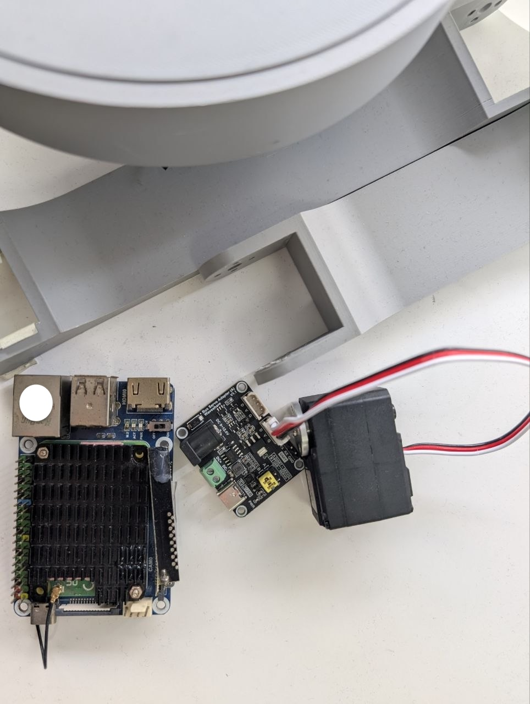
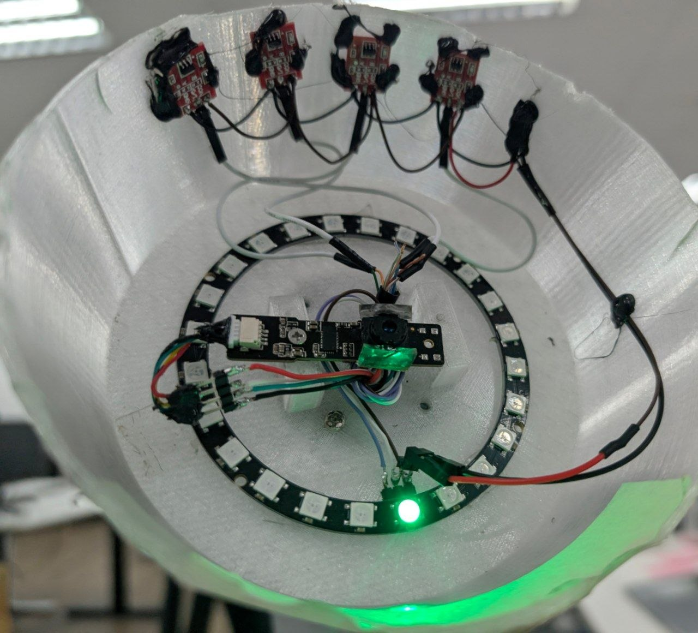

# Hardware

Designs, schematics, and specifications for the Lumi lamp hardware.

This folder is owned by the hardware team. Upload here:

- Mechanical designs (CAD, STEP, STL, renders)
- PCB schematics and board files (KiCad, Altium, Gerbers)
- BOMs and assembly drawings
- Datasheets for non-standard components
- Wiring diagrams and pinouts
- Enclosure and assembly photos

Keep large binaries (>10 MB) out of git — link them from an external store and
reference the link in a markdown file here.

---

